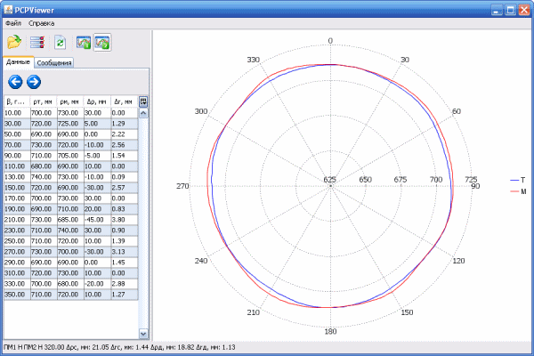

**PCPViewer**

Pipeline Coupling Position Viewer

Determination of the angular position of the coupling, in which the best match is achieved between the outer surface of the pipeline at the repair site and the inner surface of the coupling, taking into account the geometric imperfections of the mating surfaces.

